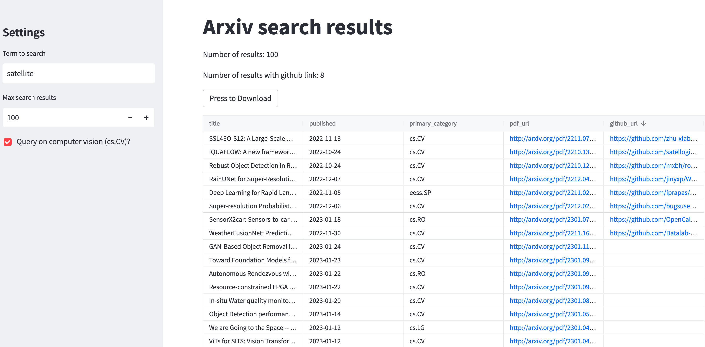

# streamlit-arxiv
Streamlit app for querying the arxiv api. Optionally check abstracts for valid (i.e. live) of Github (code) & Zenodo (dataset) links, and save results to csv.

## Usage (Mac)
* Create and activate a venv: `python3 -m venv venv` and `source venv/bin/activate`
* Install requirements: `pip install -r requirements.txt`
* `streamlit run app.py`

## References
- [arxiv.py](https://github.com/lukasschwab/arxiv.py)